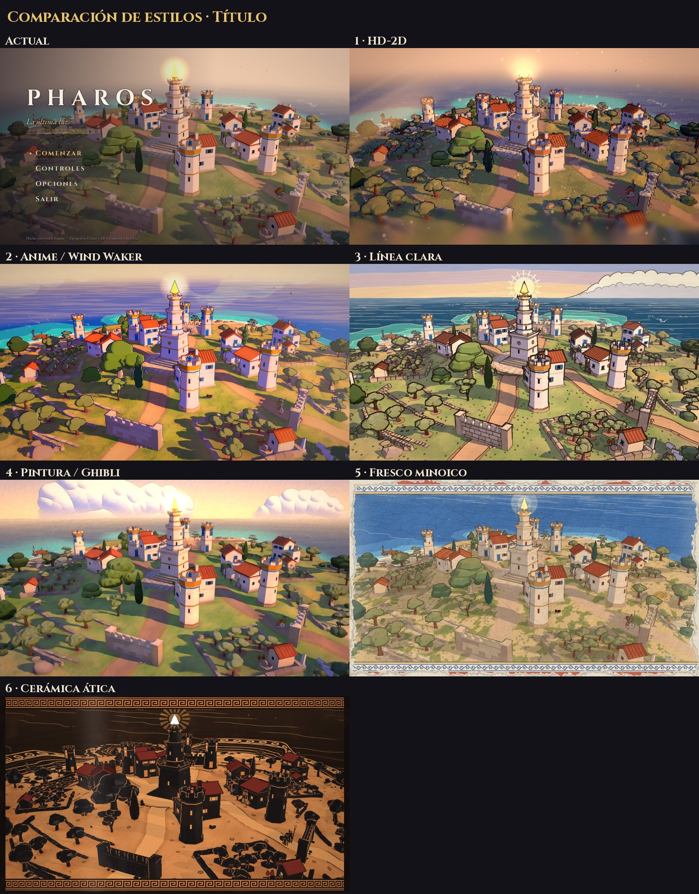
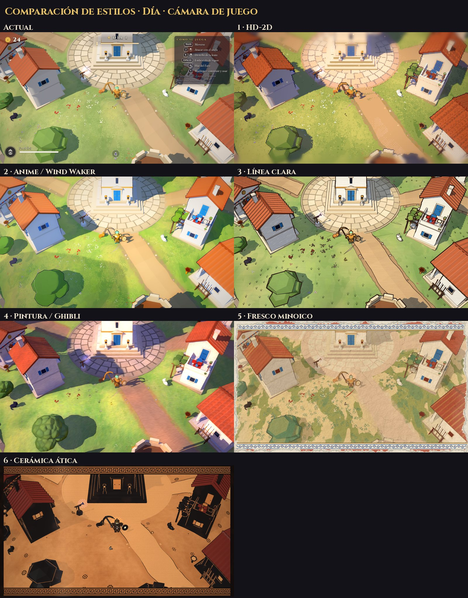
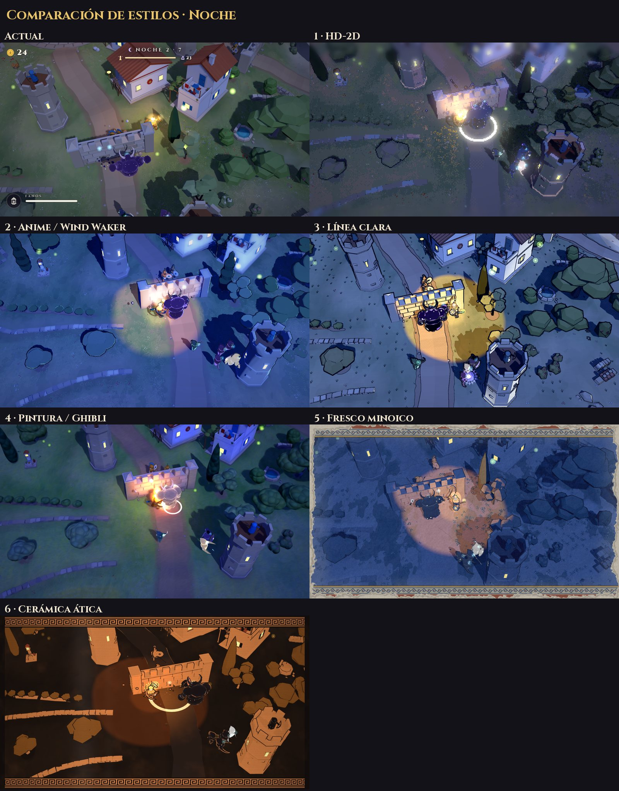

# Estilos artísticos: pruebas sobre la isla de PHAROS

> **Por qué existe este documento:** después de jugar PHAROS, el cliente dijo: *"el juego es bastante aburrido y
> visualmente tampoco me gusta, solo el mar, el resto se ve muy simplón"*. Antes de elegir el próximo juego (ver
> [`PROPUESTAS.md`](PROPUESTAS.md)), probamos otras direcciones de arte sobre **la misma escena**: la isla de PHAROS
> con su mar, su aldea y una pelea nocturna. Así se comparan los estilos lado a lado y no solo sobre el papel.

Cada prueba se hizo con nuestro propio pipeline (Godot 4.7, todo generado por código, renderer Compatibility de WebGL 2)
y muestra tres planos: el **título** a la hora dorada, la **cámara de juego** de día y una **noche** de combate. Son
maquetas de una tarde por estilo, no producción: usan los mismos modelos y sin animación nueva.

## Comparación

**Título**

**Cámara de juego, de día**

**Noche de combate**

## Los estilos

Puntuación de 0 a 10 del director de arte: **belleza** (tal como se ve en la prueba), **encaje** con el gusto del
cliente, **antisimplón** (si hace que la geometría simple parezca rica y hecha a propósito) y **viabilidad** (web y
generación por código).

| Estilo | Referencias | Belleza | Encaje | Antisimplón | Viabilidad |
|---|---|---|---|---|---|
| **1 · HD-2D / diorama pixel** | Octopath Traveler, Triangle Strategy, el pixel 3D de t3ssel8r | 7 | 9 | 7,5 | 7 |
| **2 · Anime cel-shading** | Zelda: The Wind Waker, Genshin Impact, Ni no Kuni | 7 | 7,5 | 6 | 8,5 |
| **3 · Línea clara / cómic** | Moebius, Sable, Hergé | 7 | 6 | 8 | 7 |
| **4 · Pintura / Ghibli** | Fondos de Ghibli, Ori, Genshin | 6 | 6,5 | 6 | 4,5 |
| **5 · Fresco minoico** | Frescos de Cnosos y Akrotiri | 5,5 | 5 | 6 | 7,5 |
| **6 · Cerámica ática** | Vasos de figuras negras y rojas, el juego Apotheon | 4,5 | 3,5 | 5 | 5 |

- **HD-2D:** el 3D se dibuja a 400×225 con contorno de 1 px y una paleta de 64 colores. Encima lleva la capa «HD»:
  desenfoque de maqueta, bloom, rayos de sol y motas de polvo. Su título es la mejor imagen de la prueba, y el píxel
  hace que las formas simples parezcan hechas a mano. Puntos flojos: con la cámara de juego Fanós mide unos 19 px, y la
  noche queda turbia.
- **Anime cel-shading:** luz en dos o tres bandas, contornos de color y un mar tipo Wind Waker que es el mejor de todas
  las pruebas. Es la más limpia y la más barata, pero tal cual no cura el «simplón»: prado liso, casas-caja y título
  sin cielo.
- **Línea clara:** contorno de tinta sepia, color plano, tramas, mar grabado y cúmulos entintados. Es la más personal
  y la que mejor convierte lo simple en decisión de diseño, y tiene la mejor noche (el foco de luz de borde duro). En
  contra: delata las facetas del low-poly, puede leerse infantil y no está entre las referencias del cliente.
- **Pintura / Ghibli:** pinceladas, sombras violetas y un cielo de cúmulos. Aporta el mejor cielo, pero parece un
  filtro de óleo encima del render, es la más cara en web y la menos estable en movimiento.
- **Fresco minoico:** pigmentos sobre cal, mar de azul egipcio y friso de espirales. Es la identidad más griega, pero
  queda desvaída: ocre sobre ocre y poco contraste.
- **Cerámica ática:** figuras negras de día, rojas de noche y meandros. Es un concepto potente para un cartel o un
  juego 2D lateral, pero en 3D cenital son masas negras pesadas y se pierde el mar azul.

## Recomendación

**Dirección principal: HD-2D.** Es la referencia que el cliente nombró con entusiasmo (Octopath). Es la que más cambia
la sensación de «simplón», es bonita y coherente por construcción (una paleta y una luz mandan sobre todo) y no
necesita dibujar sprites: sale de la misma geometría procedural. Antes de comprometerse, una semana de prueba para:

- verla **en movimiento** en el navegador (que el píxel no «hierva» al girar la cámara);
- dar más resolución a los personajes (resolución lógica de 640×360 o cámara más cercana);
- rehacer la **noche** (paleta nocturna propia, focos cálidos grandes, criaturas con borde y ojos brillantes);
- dosificar el desenfoque en juego y proteger el mar.

**Alternativa: anime cel-shading.** Tiene el mejor mar y la mejor lectura, es la más barata y segura, y es la buena
si el juego es rápido, de mar o con cámara que gira. Para que no se vea simplón necesita la capa de luz del HD-2D
(hora dorada, rayos, bloom), cielo visible, efectos de combate anime y más detalle de suelo.

**Ideas que tomar de los demás:** de la línea clara, el foco nocturno de borde duro, el mar grabado y el halo de rayos
del faro; de la pintura, el cielo de cúmulos y las sombras de nubes; del arte griego, los frisos, los meandros y las
cartas de dones en figuras negras para la interfaz.

## Qué estilo para qué juego

Regla rápida: **juego lento, de diorama y con cámara fija → HD-2D; juego rápido, de mar o con cámara que gira →
anime cel-shading.**

| Propuesta | Estilo | Por qué |
|---|---|---|
| Ocho Dorsales (RPG de fútbol) | HD-2D | La propuesta ya es Octopath. La cámara está más cerca y los duelos son por turnos. |
| Siete Vidas (gato, puerto, siete épocas) | HD-2D | Ritmo tranquilo y cámara que se desplaza sin girar; una paleta por época. |
| Thalassa (mundo abierto griego) | Anime cel-shading | El mar es protagonista y la cámara gira: terreno Wind Waker. |
| Episkyros (fútbol mitológico 3 contra 3) | Anime cel-shading | Arcade rápido con balón pequeño, que necesita la máxima legibilidad. |
| Bastet (TD con gatos) | Anime cel-shading | Es nocturna y con muchas unidades pequeñas, justo donde el toon se lee bien. |

## Límites de esta prueba

- Son imágenes fijas. Lo más arriesgado se ve en movimiento: el píxel que hierve al girar y las tramas y pinceladas que
  «nadan» con la cámara.
- No hay assets de producción ni animación nueva. Parte del «simplón» es de contenido (prados vacíos, casas-caja, pocos
  objetos), y eso lo arregla un pase de densidad de escenario, no un shader.
- **Ningún estilo arregla que el juego sea aburrido.** Lo hará más bonito y más dramático, pero la diversión depende
  del diseño (ver [`PROPUESTAS.md`](PROPUESTAS.md)) y de cómo responde el combate.
